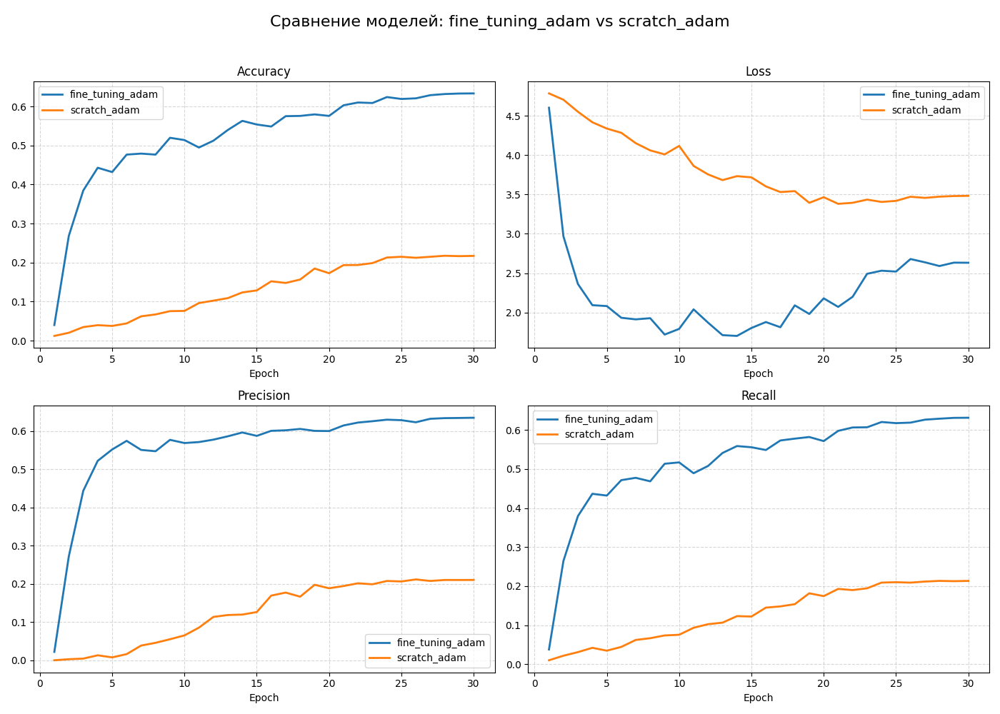

# Работу выполнили студенты 423 группы Баранова, Беликов, Лешуков, Орехов
---
# 🧠 SqueezeNet Classification — Adam vs AMSGrad, Pretrained vs Scratch

## 📌 Содержание
[1. Постановка задачи и цель работы](#title1)

[2. Теоретическая база](#title2)

[3. Результаты работы и тестирования](#title3)

[4. Выводы](#title4)

[5. Использованные источники](#title4)

## 📌 <a id="title1">1. Постановка задачи и цель работы</a>

Целью данного проекта является:
- Реализовать алгоритм глубокого обучения
- Обработать датасет [Stanford Dogs Dataset](https://www.kaggle.com/datasets/jessicali9530/stanford-dogs-dataset/data)
- Реализовать нейронную сеть с арзитектурой SqueezeNet
- Провести два типа экспериментов:
  - Дообучение предобученной модели. Сравнение предобученной модели с оптимизаторм Adam и оптимизатором AMSGrad
  - Обучение модели с нуля на Adam. Сравнение модели, обученной с нуля и дообученной модели.
- Составить отчет

---

## 📌 <a id="title2">2. Теоретическая база</a>

### 🔹 [**Архитектура SqueezeNet**](https://medium.com/@avidrishik/squeezenets-architecture-compressed-neural-network-7741d24ca56f)

SqueezeNet — компактная CNN-архитектура, разработанная для достижения точности уровня AlexNet при 50× меньшем количестве параметров.

Архитектура построена на принципе “сжать-расширить” (squeeze-expand). Fire модули сначала уменьшают количество каналов свертками 1×1 (squeeze), а затем расширяют их через параллельные 1×1 и 3×3 свертки (expand). Результат — компактная модель с хорошим качеством.

Преимущества:
- высокая скорость обучения,
- низкие требования к видеопамяти,
- приемлемая точность при низких требованиях.

$$
\text{Squeeze layer: } s = \sigma(W_s * x + b_s)
$$

$x$ — входной тензор

$W_s$ — веса 1x1 свертки

$b_s$ — смещение

$\sigma$ — функция активации (ReLU)

Expand слой (1x1 и 3x3 свертки):

$$
\text{Expand layer 1x1: } e_{1x1} = \sigma(W_{1x1} * s + b_{1x1})
$$

$$
\text{Expand layer 3x3: } e_{3x3} = \sigma(W_{3x3} * s + b_{3x3})
$$

---

### 🔹 [**Оптимизатор Adam**](https://www.geeksforgeeks.org/deep-learning/adam-optimizer/)
Один из самых популярных оптимизаторов для обучения нейронных сетей.
Adam комбинирует идеи:
- Momentum (ускоряет обучение, сглаживает траекторию градиента)
- RMSProp (регулирует шаг обучения индивидуально для каждого параметра)

Использует два экспоненциально сглаженных момента:  
первый (m) — Накопленный средний градиент (помогает сгладить шум в обучении),  
второй (v) — Накопленный средний квадрат градиента (уменьшает шаг при больших градиентах).  

Преимущества Adam:
- Быстро сходится на большинстве задач
- Устойчив к шумным градиентам
- Подходит для больших датасетов, глубоких сетей
- Практически не требует ручного подбора гиперпараметров
- Обновляет параметры адаптивно для каждого веса

<a id="Adam">Градиент</a>:

$$
\text{Gradient: } g_t = \nabla_\theta L(\theta_t)
$$

Скользящее среднее первого момента (сдвиг):

$$
\text{First moment estimate: } m_t = \beta_1 m_{t-1} + (1 - \beta_1) g_t
$$

Скользящее среднее второго момента (квадрат градиентов):

$$
\text{Second moment estimate: } v_t = \beta_2 v_{t-1} + (1 - \beta_2) g_t^2
$$

Коррекция смещения:

$$
\text{Bias-corrected estimates: } \hat{m}_t = \frac{m_t}{1 - \beta_1^t}, \quad \hat{v}_t = \frac{v_t}{1 - \beta_2^t}
$$

Обновление параметров:

$$
\text{Parameter update: } \theta_{t+1} = \theta_t - \eta \frac{\hat{m}_t}{\sqrt{\hat{v}_t} + \epsilon}
$$

---

### 🔹 [**Оптимизатор AMSGrad**](https://apxml.com/courses/optimization-techniques-ml/chapter-3-adaptive-learning-rate-algorithms/amsgrad-optimizer)

Модификация Adam, гарантирующая монотонное уменьшение второго момента:

- предотвращает "всплески" learning rate,
- улучшает стабильность,
- лучше ведёт себя на плохо обусловленных задачах.

AMSGrad особенно полезен, если обучение "колеблется" или плохо стабилизируется.

Градиент, первый момент, воторой момент как в [Adam](#Adam)

Максимум второго момента (ключевое отличие):

$$
\text{Maintain maximum of second moment: } \hat{v}_t = \max(\hat{v}_{t-1}, v_t)
$$

Коррекция смещения первого момента:

$$
\text{Bias-corrected first moment: } \hat{m}_t = \frac{m_t}{1 - \beta_1^t}
$$

Обновление параметров:

$$
\text{Parameter update: } \theta_{t+1} = \theta_t - \eta \frac{\hat{m}_t}{\sqrt{\hat{v}_t} + \epsilon}
$$

---

## 📌 <a id="title3">3. Результаты работы и тестирования</a>

### 📊 Метрики, собираемые системой:

- **loss_val**
- **accuracy_val**
- **precision_val**
- **recall_val**
- **learning_rate**

Все результаты автоматически сохраняются в `CSV/`

---

### 📈 Примеры графиков

---

### 📋 Таблица итоговых сравнения моделей

| Модель | Инициализация | Оптимизатор | Accuracy | Precision | Recall |
|--------|----------------|-------------|----------|-----------|--------|
| SqueezeNet | Pretrained | Adam | 0.63 | 0.63 | 0.63 |
| SqueezeNet | Pretrained | AMSGrad | 0.63 | 0.63 | 0.63 |
| SqueezeNet | Scratch | Adam | 0.22 | 0.21 | 0.21 |

---

## 📌 <a id="title4">4. Выводы</a>

В ходе исследования были получены следующие результаты:

- Предобученная модель демонстрирует **более быструю сходимость** и **более высокую итоговую точность**.
- Оптимизатор **AMSGrad** показал немного лучшую стабильность.
- Обучение с нуля требует намного большего количества эпох.
- После 15 эпохи (ввиду увеличения loss) наблюдается переобучение.

---

## 📌 <a id="title5">5. Использованные источники</a>

1. https://arenda-server.cloud/blog/populjarnye-arhitektury-glubokogo-obuchenija-resnet-inceptionv3-squeezenet/ 
2. https://www.geeksforgeeks.org/deep-learning/adam-optimizer/
3. https://apxml.com/courses/optimization-techniques-ml/chapter-3-adaptive-learning-rate-algorithms/amsgrad-optimizer 
4. https://www.kaggle.com/code/ad271828/squeezenet-pytorch-fruit-classification/notebook

